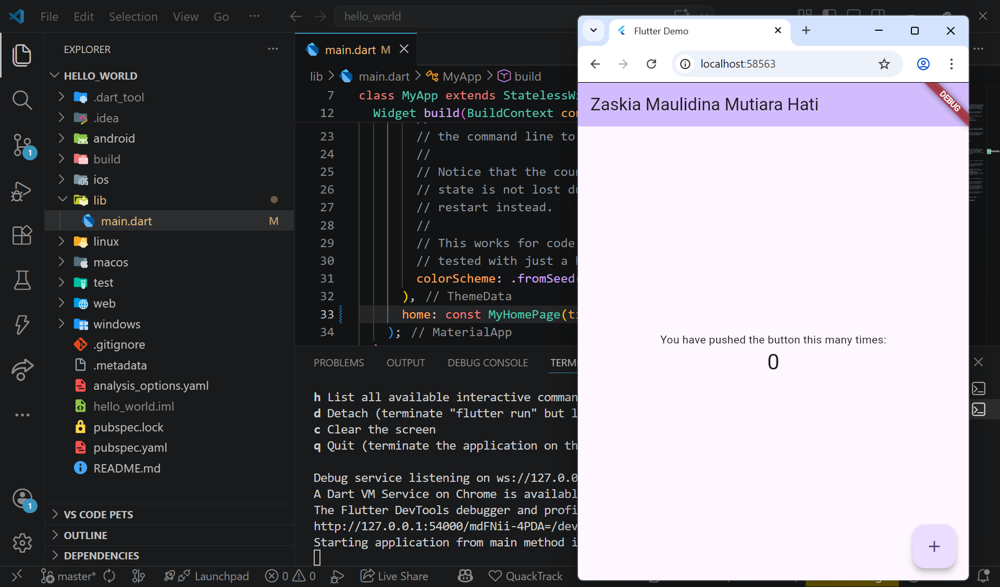
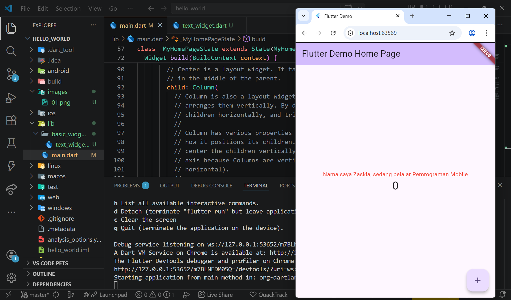
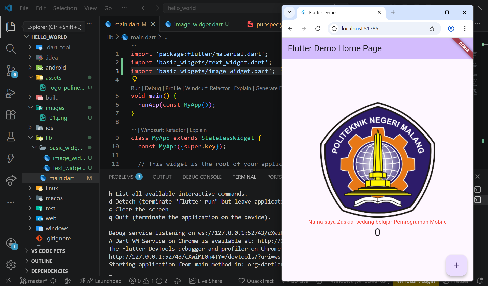
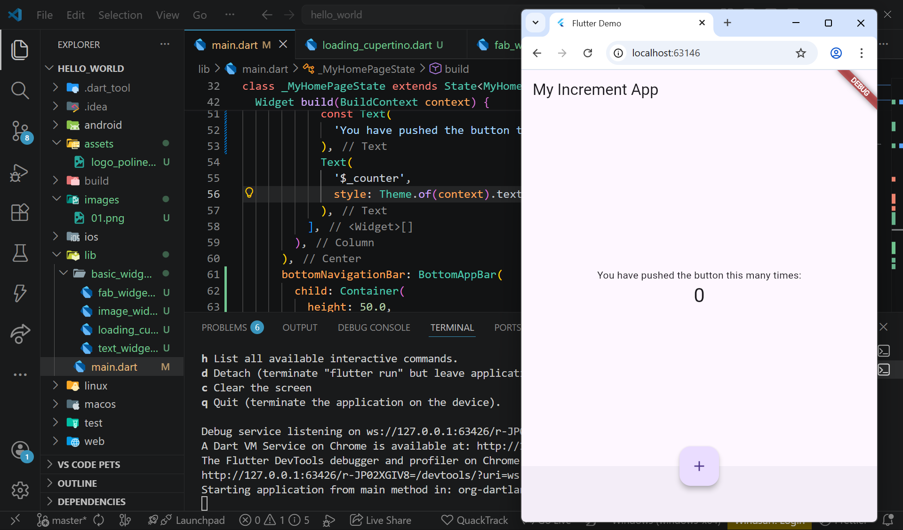
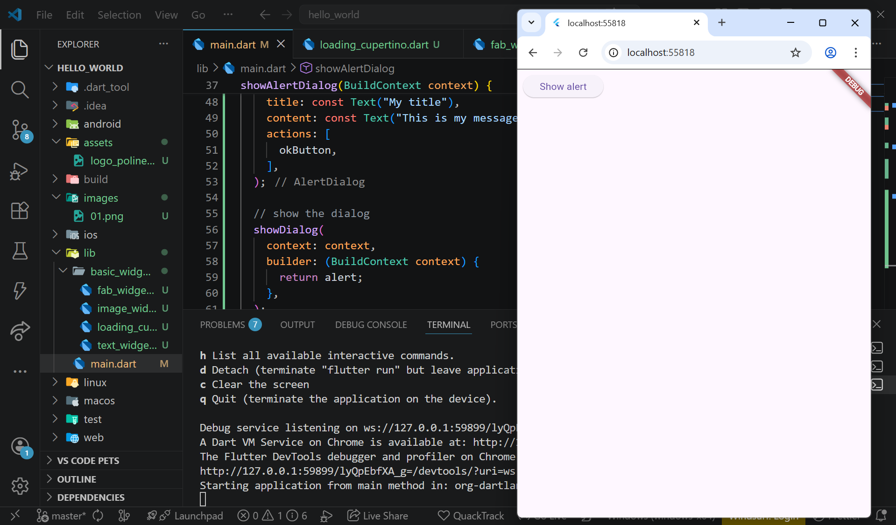
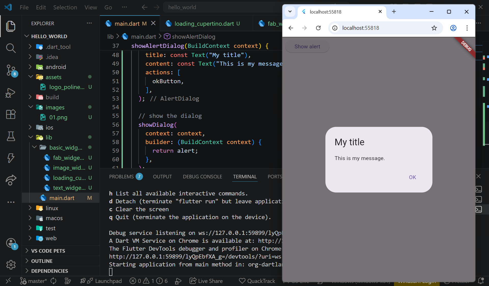
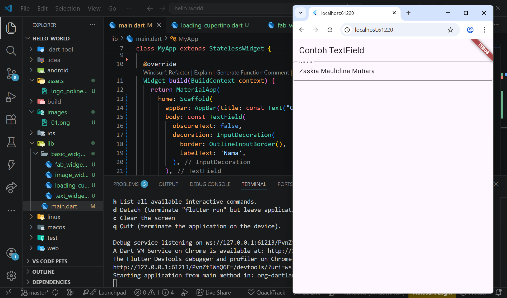
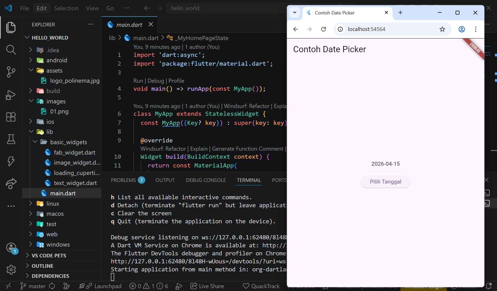
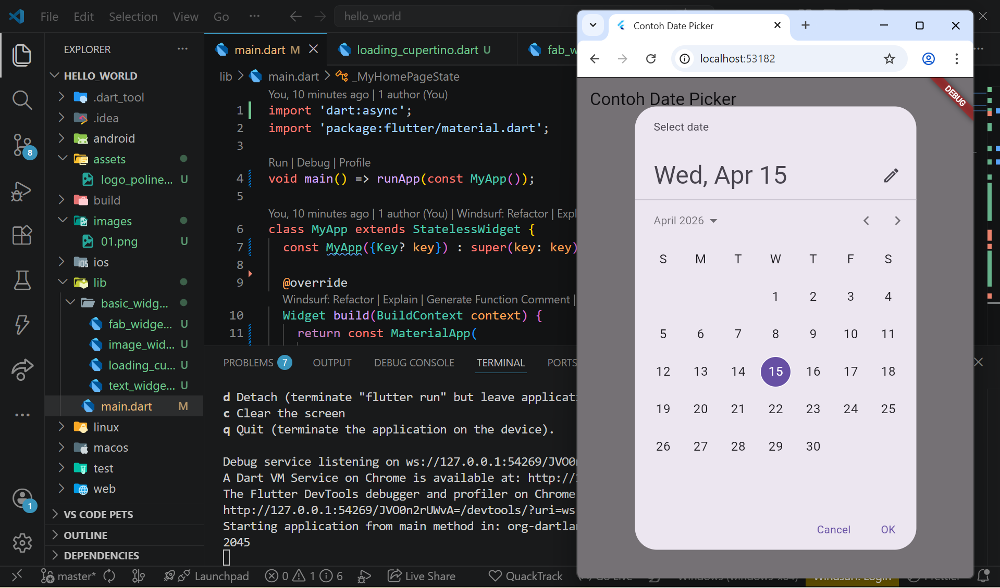

# Praktikum Pemrograman Mobile – Week 04

|---------|-------------------------------|
| Nama  : | Zaskia Maulidina Mutiara Hati |
|---------|-------------------------------|
| Kelas : | SIB 2-F                       | 
|---------|-------------------------------|
| NIM   : | 244107060056                  |
|---------|-------------------------------|

# Praktikum 1 : Membuat Project Flutter Baru
- Membuat projek Flutter dengan nama hello_world 

# Praktikum 2 : Menghubungkan Perangkat Android ataU Emulator

# Praktikum 3 : Membuat Repository GitHub dan Laporan Praktikum
- Membuat repository github dengan nama flutter-fundamental-part1

link github flutter-fundamental-part 1 : https://github.com/iakmorales/flutter-fundamental-part1.git 

- Percobaan pertama

# Praktikum 4 : Menerapkan Widget Dasar
- Praktek Text Widget

- Praktek Image Widget

# Praktikum 5 : Menerapkan Widget Material Design dan iOS Curpetino
- Cupertino Button
- Floating action Button

- Scaffold Widegt

- Dialog Widget

- Input dan Selection Widget

- Date ada Time Pickers

